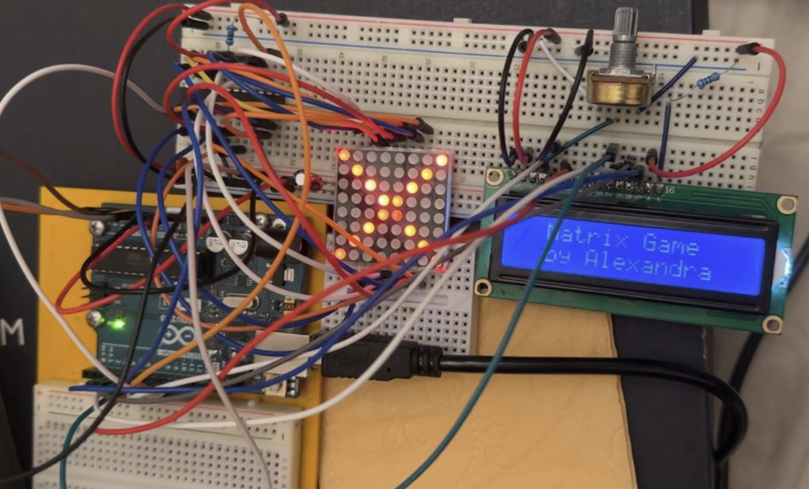

# Matrix Project - Checkpoint 1

### Task Description
Create an interactive LED matrix demo with menu navigation for the "Introduction to Robotics" course. This checkpoint establishes the foundation for a complete matrix game, featuring a working 8x8 LED matrix controlled via joystick, a 16x2 LCD display with menu navigation, and an interactive drawing demo. The project follows clean architecture principles with modular, non-blocking code and proper hardware abstraction.

### Technical Requirements
- Implement a state machine with multiple phases (Intro, Menu, GameDemo)
- Use MAX7219-driven 8x8 LED matrix with LedControl library
- Use 16x2 LCD display with LiquidCrystal library
- Handle joystick input for navigation and interaction
- Support joystick button for menu selection and LED state cycling
- Implement wrap-around cursor movement on the matrix
- Create LED blinking effects at different speeds (slow/fast)
- Implement long-press detection for exiting the demo
- Follow clean code practices: no magic numbers, use constants, modular design
- Use non-blocking code (no `delay()` in main loop)

### Components Used
| Component | Quantity | Purpose |
|-----------|----------|---------|
| Arduino Uno | 1 | Microcontroller board |
| 8x8 LED Matrix (MAX7219) | 1 | Game display interface |
| 16x2 LCD Display | 1 | Menu and status display |
| Joystick Module (X, Y, SW) | 1 | Navigation and drawing control |
| Resistors (1K) | 1 | Matrix |
| Potentiometer | 1 | LCD brightness control |
| Breadboard | 1 | Circuit assembly |
| Jumper Wires | Multiple | Connections |

### Circuit Design

The circuit connects four main components to the Arduino:

1. **LED Matrix (MAX7219):** Uses 3 pins (DIN, CLK, LOAD) for SPI-like communication
2. **LCD Display:** Uses 6 pins (RS, EN, D4-D7) in 4-bit mode
3. **Joystick Input:** Analog axes (X/Y) and digital button for control
4. **Power & Ground:** All components share common 5V and GND rails

**Pin Configuration:**

*LED Matrix (MAX7219):*
- DIN -> Pin 12
- CLK -> Pin 11
- LOAD (CS) -> Pin 10
- VCC -> 5V
- GND -> GND

*LCD (4-bit mode):*
- RS -> Pin 9
- EN -> Pin 8
- D4 -> Pin 7
- D5 -> Pin 6
- D6 -> Pin 5
- D7 -> Pin 4
- VCC -> 5V
- GND -> GND

*Joystick:*
- VRx (X-Axis) -> Pin A0
- VRy (Y-Axis) -> Pin A1
- SW (Button) -> Pin A2
- VCC -> 5V
- GND -> GND

#### Physical Implementation

**Hardware Setup:**



*Figure: Physical circuit assembled on breadboard showing Arduino Uno, MAX7219 LED matrix, 16x2 LCD display, joystick module, and wiring.*

---

### System States and Behavior

The application operates as a **finite state machine** with the following phases:

#### Phase 1: INTRO (Startup Screen)
- **Display (LCD):** Shows "Matrix Game" and "by Alexandra" centered
- **Display (Matrix):** Shows an X pattern (both diagonals lit)
- **Duration:** 2.5 seconds, then automatically transitions to Menu
- **Behavior:** Entry animation when powering on the device

#### Phase 2: MENU (Navigation)
- **Display (LCD):** Shows menu option "> Start Game" with cursor indicator
- **Display (Matrix):** Cleared (idle state)
- **Controls:** Joystick Left/Right to navigate (future options), SW press to select
- **Behavior:** Selecting "Start Game" transitions to GameDemo phase

#### Phase 3: GAME DEMO (Interactive Drawing)
- **Display (LCD):** Shows "Draw Mode" with current position (x,y) and LED state
- **Display (Matrix):** Shows cursor LED and any placed LEDs with their states
- **Controls:**
  - Joystick: Move cursor around the 8x8 matrix (with wrap-around)
  - Button Short Press: Cycle LED state at current position
  - Button Long Press (1.5s): Exit to Menu
- **LED States (cycle order):**
  1. **ON** - Solid, always lit
  2. **SLOW** - Blinks every 500ms
  3. **FAST** - Blinks every 150ms
  4. **OFF** - Not lit

---

### Implementation Details

#### Project Structure

The codebase follows a **modular architecture** with clean separation of concerns. Each hardware component is wrapped in its own class for abstraction and reusability:

```
Matrix-Checkpoint1/
├── src/
│   ├── proiect1.ino              # Main Arduino sketch with state machine
│   ├── Constants.h               # All pin definitions and timing constants
│   ├── MatrixDisplay.h/.cpp      # MAX7219 LED matrix wrapper
│   ├── LCDDisplay.h/.cpp         # 16x2 LCD display wrapper
│   ├── Joystick.h/.cpp           # Joystick input with deadzone handling
│   ├── PushButton.h/.cpp         # Debounced button input
│   ├── MenuController.h/.cpp     # Menu navigation logic
│   └── GameDemo.h/.cpp           # Interactive drawing demo
└── README.md                     # This file
```

Each component is encapsulated in its own class for **modularity, testability, and reusability**.

#### State Machine Implementation

The main sketch uses an enum-based state machine:

```cpp
enum class AppState : byte
{
    Intro,      // Showing intro message
    Menu,       // Main menu
    GameDemo    // Interactive demo
};
```

The `loop()` function dispatches to the appropriate update function based on current state, ensuring clean separation of phase-specific logic.

#### LED State Cycling

The drawing demo implements a 4-state cycle for each LED position:

```cpp
enum class LedState : byte
{
    On = 0,        // Solid - always lit
    BlinkSlow,     // Blinks every 500ms
    BlinkFast,     // Blinks every 150ms
    Off,           // Not lit
    COUNT          // Number of states (for modulo)
};
```

When the button is pressed, the current LED cycles: **ON -> SLOW -> FAST -> OFF -> ON -> ...**

#### Cursor Movement with Wrap-Around

The cursor wraps around edges using modular arithmetic:

```cpp
void GameDemo::moveCursor(int8_t dx, int8_t dy)
{
    // Turn off LED at current position
    ledStates[cursorY][cursorX] = LedState::Off;

    // Move cursor (wrap around edges)
    cursorX = (cursorX + dx + MatrixConstants::SIZE) % MatrixConstants::SIZE;
    cursorY = (cursorY + dy + MatrixConstants::SIZE) % MatrixConstants::SIZE;

    // Turn on LED at new position
    ledStates[cursorY][cursorX] = LedState::On;

    renderLCD();
}
```

This ensures the cursor seamlessly moves from edge to opposite edge (column 7 -> 0, row 0 -> 7, etc.).

#### Non-Blocking Blink Implementation

LED blinking uses time-division without blocking:

```cpp
void GameDemo::renderMatrix(unsigned long currentTime)
{
    // Calculate blink phases based on current time
    bool slowBlinkOn = ((currentTime / GameDemoConstants::SLOW_BLINK_MS) % 2) == 0;
    bool fastBlinkOn = ((currentTime / GameDemoConstants::FAST_BLINK_MS) % 2) == 0;

    for (byte y = 0; y < MatrixConstants::SIZE; y++)
    {
        for (byte x = 0; x < MatrixConstants::SIZE; x++)
        {
            bool ledOn = false;
            
            switch (ledStates[y][x])
            {
                case LedState::On:
                    ledOn = true;  // Always on
                    break;
                case LedState::BlinkSlow:
                    ledOn = slowBlinkOn;  // Follows slow phase
                    break;
                case LedState::BlinkFast:
                    ledOn = fastBlinkOn;  // Follows fast phase
                    break;
                case LedState::Off:
                default:
                    ledOn = false;
                    break;
            }

            matrix->setLed(y, x, ledOn);
        }
    }
}
```

This approach allows multiple LEDs to blink at different rates simultaneously without using `delay()`.

#### Hardware Abstraction

**MatrixDisplay Class:**
Wraps the LedControl library and maintains an internal buffer for LED states:
- `setLed(row, col, state)` - Set individual LED
- `clear()` - Clear entire display
- `getLed(row, col)` - Read LED state from buffer
- `setBrightness(level)` - Adjust brightness (0-15)

**LCDDisplay Class:**
Wraps the LiquidCrystal library with convenience methods:
- `showMessage(line1, line2)` - Display two centered lines
- `printAt(col, row, text)` - Print at specific position
- `clear()` - Clear display

**Joystick Class:**
Handles analog input with deadzone and button debouncing:
- `getDirection()` - Returns UP/DOWN/LEFT/RIGHT/NONE
- `wasButtonPressed()` - Returns true once per press
- `isButtonPressed()` - Returns current button state

---

### Game Direction (Future Development)

For the final Matrix Project, I plan to develop a game that will include:

- Full 16x16 logical matrix (4 rooms or fog of war visibility)
- Multiple difficulty levels with progression
- Scoring system with EEPROM highscore persistence
- Sound effects using passive buzzer
- Sensor integration for enhanced gameplay
- Complete menu system (Settings, About, How to Play, Highscores)

### Checkpoint 2 Plan

For Checkpoint 2 (December 8-13), I will focus on:
- Implementing the core game mechanics
- Adding the 16x16 matrix functionality
- Creating the complete menu system with all required options
- Integrating sound effects

---

### Media

**Demo Video:**  
[Watch on YouTube](https://youtu.be/xGMVg2tsSYI?si=rqkpi1Rvko4heGsb)

**Source Code:**  
[View on GitHub](https://github.com/ale0204/MatrixProject/tree/main/Matrix-Checkpoint1/src)

---

### Key Learnings

This checkpoint demonstrates fundamental embedded systems concepts:

**State Machine Design:** Clean phase transitions organize application flow  
**Hardware Abstraction:** Wrapper classes isolate hardware-specific code  
**Clean Code Practices:** Eliminated magic numbers, modular architecture  
**Input Handling:** Deadzone filtering and button debouncing for reliable input  
**Modular Architecture:** Each component in separate files for maintainability

---
